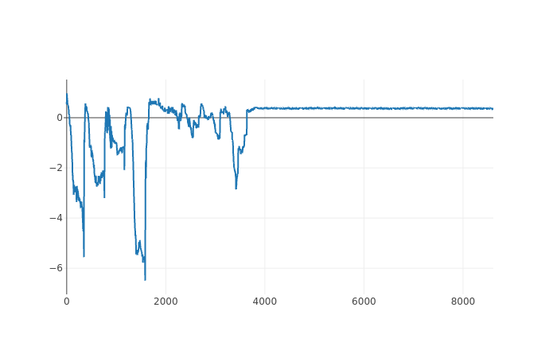

# EDELWAC²E

Reinforcement Learning Agents for
[GAC²E](https://github.com/AugustUnderground/gace) through
[Hym](https://github.com/AugustUnderground/hym) with
[HaskTorch](https://github.com/hasktorch/hasktorch).

## Setup

LibTorch is required, as per HaskTorch Documentation, and must be symlinked
into this directory. Then source `setenv` in your shell.

For training, [Hym](https://github.com/AugustUnderground/hym) must be up
and running.

For tracking, [mlflow](https://www.mlflow.org) and
[mlflow-hs](https://github.com/AugustUnderground/mlflow-hs) must be installed.

```bash
$ source setenv
$ stack build
```

## Usage

With default options

```bash
$ stack run
```

otherwise

```bash
$ stack exec -- edelwace-exe [options]
```

```
Usage: edelwace-exe [-l|--algorithm ALGORITHM] [-H|--host HOST] [-P|--port PORT]
                    [-i|--ace ID] [-p|--pdk PDK] [-v|--var VARIANT]
                    [-a|--act ACTIONS] [-o|--obs OBSERVATIONS] [-f|--path FILE]
                    [-T|--tracking-host HOST] [-R|--tracking-port PORT]
  GACE RL Trainer

Available options:
  -l,--algorithm ALGORITHM DRL Algorithm, one of sac, td3, ppo (default: "sac")
  -H,--host HOST           Hym server host address (default: "localhost")
  -P,--port PORT           Hym server port (default: "7009")
  -i,--ace ID              ACE OP ID (default: "op2")
  -p,--pdk PDK             ACE Backend (default: "xh035")
  -v,--var VARIANT         GACE Environment Variant (default: "0")
  -a,--act ACTIONS         Dimensions of Action Space (default: 10)
  -o,--obs OBSERVATIONS    Dimensions of Observation Space (default: 39)
  -f,--path FILE           Checkpoint File Path (default: "./models")
  -T,--tracking-host HOST  MLFlow tracking server host address
                           (default: "localhost")
  -R,--tracking-port PORT  MLFlow tracking server port (default: "5000")
  -h,--help                Show this help text
```

### Dependencies

- hasktorch
- libtorch-ffi
- mtl
- wreq
- aeson
- optparse-applicative
- mlflow-hs

## Algorithms

[Haddock](https://augustunderground.github.io/edelwace/) is availbale.

**Caution:** Excessive use of Unicode and Strictness.

### Soft Actor Critic (SAC)

[Arxiv](https://arxiv.org/abs/1812.05905v2)

Soft Actor Critic (SAC) Agent for continuous action space. Start with `-l sac`
and `-v 0` for continuous electrical design space.

It appears that state scaling / standardization makes things worse for SAC. The
loss steadily increases and no learning occurs.

### Proximal Policy Optimization (PPO)

[Arxiv](https://arxiv.org/abs/1707.06347)

Proximal Policy Optimization (PPO) Agent for discrete and continuous action
spaces. Start with `-l ppo` and `-v 2` for discrete electrical design space.

Dscrete PPO needs about ~4k steps before plateauing around an average reward of
~0.4. The area is way smaller than the target, while offset is not quite
reached.



### Twin Delayed Deep Deterministic Policy Gradient (TD3)

[Arxiv](https://arxiv.org/abs/1802.09477)

Twin Delayed Deep Deterministic Policy Gradient (TD3) Agent for continuous
action space. Start with `-l td3` and `-v 0` for continuous electrical design
space.

### Prioritized Experience Replay (PER)

[Arxiv](https://arxiv.org/abs/1511.05952)

Only implemented in SAC and deactivated for the moment. To quote ERE Paper:

> We show that SAC+PER can marginally improve the sample efficiency performance
> of SAC, but much less so than SAC+ERE. 

### Emphasizing Recent Experience (ERE)

[Arxiv](https://arxiv.org/abs/1906.04009)

...

### Hindsight Experience Replay (HER)

[Arxiv](https://arxiv.org/abs/1707.01495)

...

## Results

...

## TODO

- [X] Implement SAC
- [X] Implement TD3
- [X] Implement PPO
- [X] Implement PER
- [X] Implement ERE
- [X] Implement SAC+PER
- [X] Implement SAC+ERE
- [ ] Implement SAC+ERE+PER
- [X] Implement HER
- [ ] Implement TD3+HER
- [ ] Wait for Normal Distribution in HaskTorch
- [ ] Remove strictness where unecessary
- [X] Add agent loading ability
- [X] Command Line Options
- [X] MLFlow tracking
- [X] Visualization (MLFlow?)
